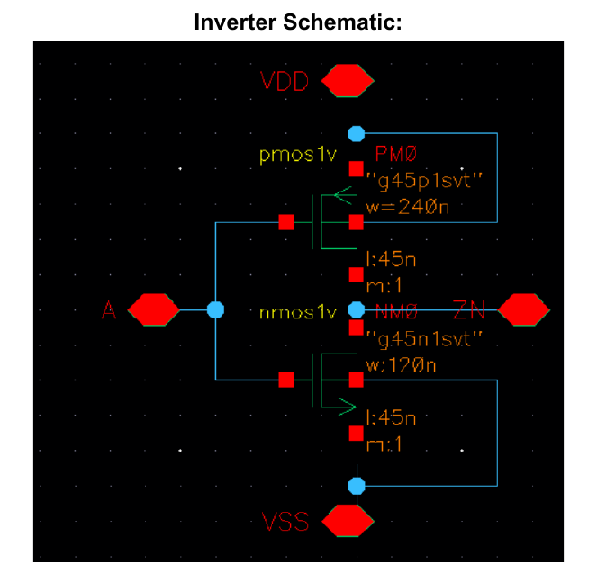
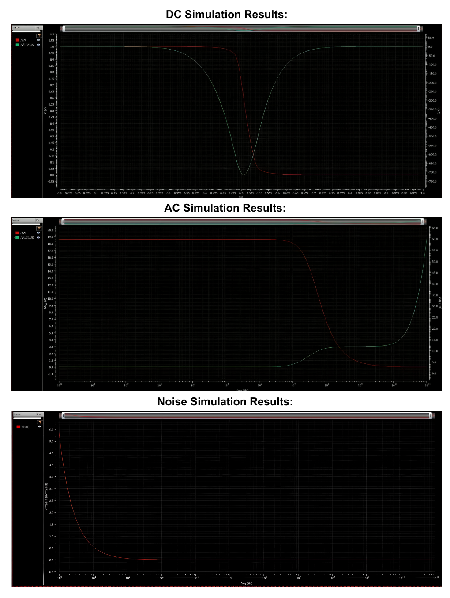
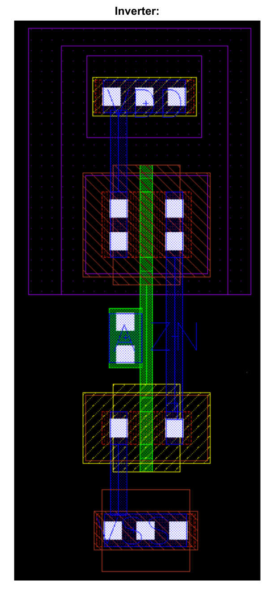

# TU/e Biopotential and Neural Interface Circuits (5XCC0)

Integrated circuit design work for the Biopotential and Neural Interface Circuits course
(5XCC0) at Eindhoven University of Technology (TU/e). The course builds the analog
front-end that reads microvolt-level biopotential and neural signals: a low-noise
amplifier raises the signal, a low-pass filter band-limits it, and a
successive-approximation ADC digitizes it.

The design work is done in Cadence Virtuoso on the GPDK045 45 nm process, simulated with
Spectre, and verified with Assura (design rule check, layout versus schematic, and
parasitic extraction). Two of the assignments model the acquisition chain at system
level in MATLAB before it is built at transistor level.

## Design libraries

Each Cadence library holds one subsystem of the front-end as a set of schematic and
symbol cellviews with their testbenches.

### 5XCC0_AMP: low-noise amplifier

A differential amplifier with common-mode feedback. The library builds the amplifier
bottom up: a single transistor characterization testbench, an amplifier stage, the
amplifier core, and the full `AMPLIFIER` cell, with an ideal common-mode feedback block
(`CMFB_IDEAL`) and dedicated testbenches (`AMPLIFIER_TB`, `TRANSISTOR_TB`).

### 5XCC0_LPF: Gm-C low-pass filter

A transconductance-capacitor (Gm-C) low-pass filter built from a `GM_C_STAGE`
transconductor into a `GM_C_FILTER`, with a `FILTER_TB` testbench for the frequency
response.

### 5XCC0_ADC: 12-bit SAR ADC

A successive-approximation-register ADC. The top-level `SARADC` is assembled from a
track-and-hold (`TH`), a dynamic `COMPARATOR`, a capacitive `DAC`, and the SAR control
logic (`SARLOGIC`, `DFFR`). The digital cells are designed at transistor level as a small
standard-cell set (`INV`, `INV_HVT`, `INV_LVT`, `NAND`, `NOR`), and a Verilog-A
`DAC_IDEAL` provides a 12-bit ideal reference for verification. Testbenches cover the
inverter (`INV_TB`), the converter (`ADC_TB`), and the full system (`SYSTEM_TB`).

## Assignments

- **Assignment 1 and 2**: system-level modeling of the acquisition chain in MATLAB. The
  `.mat` files hold the input data and the results computed from the behavioral system
  model.
- **Assignment 3**: full custom layout flow for a CMOS inverter, from schematic to
  signed-off layout (shown below).
- **Assignment 6**: schematic of a neural recording array (`neuralRecordingArrays`).

## Assignment 3: full custom design flow

Assignment 3 takes a single CMOS inverter through the complete custom IC flow. The
schematic uses a 240 nm wide PMOS and a 120 nm wide NMOS at the 45 nm minimum length.



The cell is characterized with DC, AC, and noise analyses in Spectre. The DC sweep shows
the switching threshold and the gain peak at the transition, the AC analysis shows the
gain and phase across frequency, and the noise analysis shows the input-referred noise
spectrum.



The transistors are then laid out by hand, with the shared poly gate running through the
PMOS and NMOS diffusions. The layout passes design rule check with no violations, matches
the schematic under LVS, and is back-annotated with extracted parasitic capacitances for
post-layout simulation.



## Repository layout

```
5XCC0_AMP/            Cadence library: low-noise amplifier
5XCC0_LPF/            Cadence library: Gm-C low-pass filter
5XCC0_ADC/            Cadence library: 12-bit SAR ADC and standard cells
Assignment 1/         MATLAB system-model data
Assignment 2/         MATLAB system-model data and results
Assignment 3/         inverter layout library and PDF report
Assignment 6/         neural recording array schematic
```

The libraries are stored in Cadence OpenAccess format (`.oa` cellviews), so they are
opened from within Cadence Virtuoso rather than viewed as plain files.

## Technologies

Cadence Virtuoso, Spectre, GPDK045 (45 nm) PDK, Assura (DRC, LVS, RC extraction),
Verilog-A, MATLAB.
